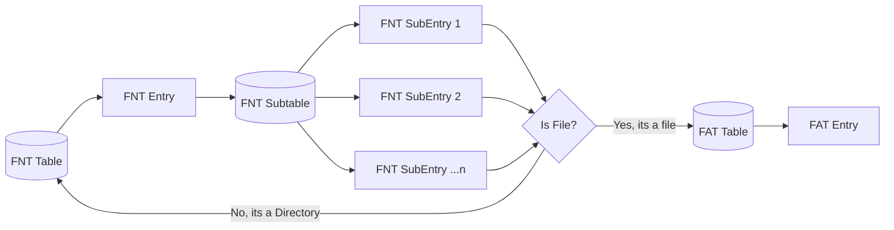

## How to Read The Entire File System?

```mermaid
flowchart LR
    A[(FNT Table)]
    B[(FAT Table)]
    C[(FNT Subtable)]

    d[FNT Entry]
    e[FNT SubEntry 1]
    e2[FNT SubEntry 2]
    e3[FNT SubEntry ...n]
    f[FAT Entry]

    D{Is File?}

    A --> d 
    d --> C
    
    C --> e
    C --> e2
    C --> e3
    
    e --> D
    e2 --> D
    e3 --> D

    D -->|No, its a Directory| A
    D -->|Yes, its a file| B --> f

```