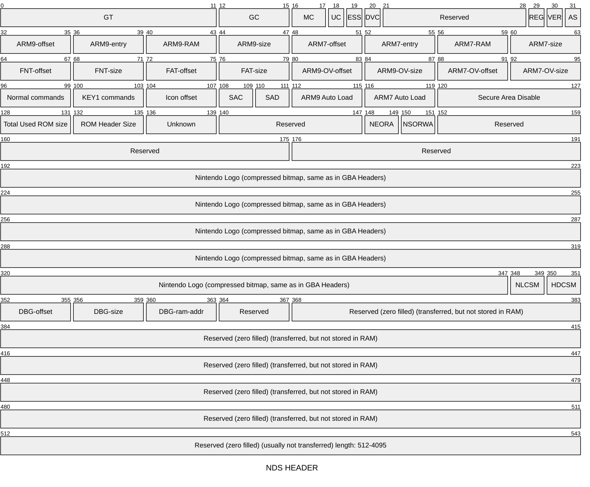
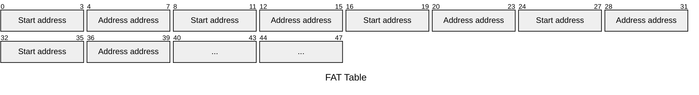
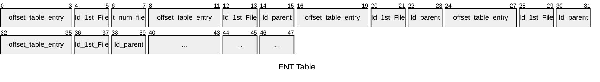

# NDS HEADER

```mermaid
packet-beta
title NDS HEADER
0-11: "GT"
12-15: "GC"
16-17: "MC"
18: "UC"
19: "ESS"
20: "DVC"
21-28: "Reserved"
29: "REG"
30: "VER"
31: "AS"
32-35: "ARM9-offset"
36-39: "ARM9-entry"
40-43: "ARM9-RAM"
44-47: "ARM9-size"
48-51: "ARM7-offset"
52-55: "ARM7-entry"
56-59: "ARM7-RAM"
60-63: "ARM7-size"
64-67: "FNT-offset"
68-71: "FNT-size"
72-75: "FAT-offset"
76-79: "FAT-size"
80-83: "ARM9-OV-offset"
84-87: "ARM9-OV-size"
88-91: "ARM7-OV-offset"
92-95: "ARM7-OV-size"
96-99: "Normal commands"
100-103: "KEY1 commands"
104-107: "Icon offset"
108-109: "SAC"
110-111: "SAD"
112-115: "ARM9 Auto Load"
116-119: "ARM7 Auto Load"
120-127: "Secure Area Disable"
128-131: "Total Used ROM size"
132-135: "ROM Header Size"
136-139: "Unknown"
140-147: "Reserved"
148-149: "NEORA"
150-151: "NSORWA"
152-175: "Reserved"
176-191: "Reserved"
192-347: "Nintendo Logo (compressed bitmap, same as in GBA Headers)"
348-349: "NLCSM"
350-351: "HDCSM"
352-355: "DBG-offset"
356-359: "DBG-size"
360-363: "DBG-ram-addr"
364-367: "Reserved"
368-511: "Reserved (zero filled) (transferred, but not stored in RAM)"
512-543: "Reserved (zero filled) (usually not transferred) length: 512-4095"
```
Special Thanks to Martin Korth for all the information availiable at: http://problemkaputt.de

This Diagram is just for general overview more info 

## FAT Table

```mermaid
---
title: "FAT Table"
---
packet-beta
    0-3: "Start address"
    4-7: "Address address"
    8-11: "Start address"
    12-15: "Address address"
    16-19: "Start address"
    20-23: "Address address"
    24-27: "Start address"
    28-31: "Address address"
    32-35: "Start address"
    36-39: "Address address"
    40-43: "..."
    44-47: "..."
```
## FNT Table

```mermaid
---
title: "FNT Table"
---
packet-beta
    0-3: "offset_table_entry"
    4-5: "Id_1st_File"
    6-7: "t_num_file"
    8-11: "offset_table_entry"
    12-13: "Id_1st_File"
    14-15: "Id_parent"
    16-19: "offset_table_entry"
    20-21: "Id_1st_File"
    22-23: "Id_parent"
    24-27: "offset_table_entry"
    28-29: "Id_1st_File"
    30-31: "Id_parent"
    32-35: "offset_table_entry"
    36-37: "Id_1st_File"
    38-39: "Id_parent"
    40-43: "..."
    44-45: "..."
    46-47: "..."
```